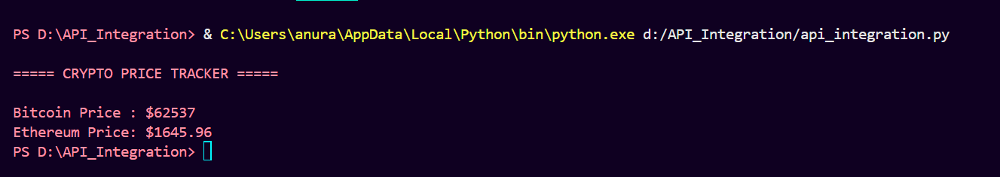
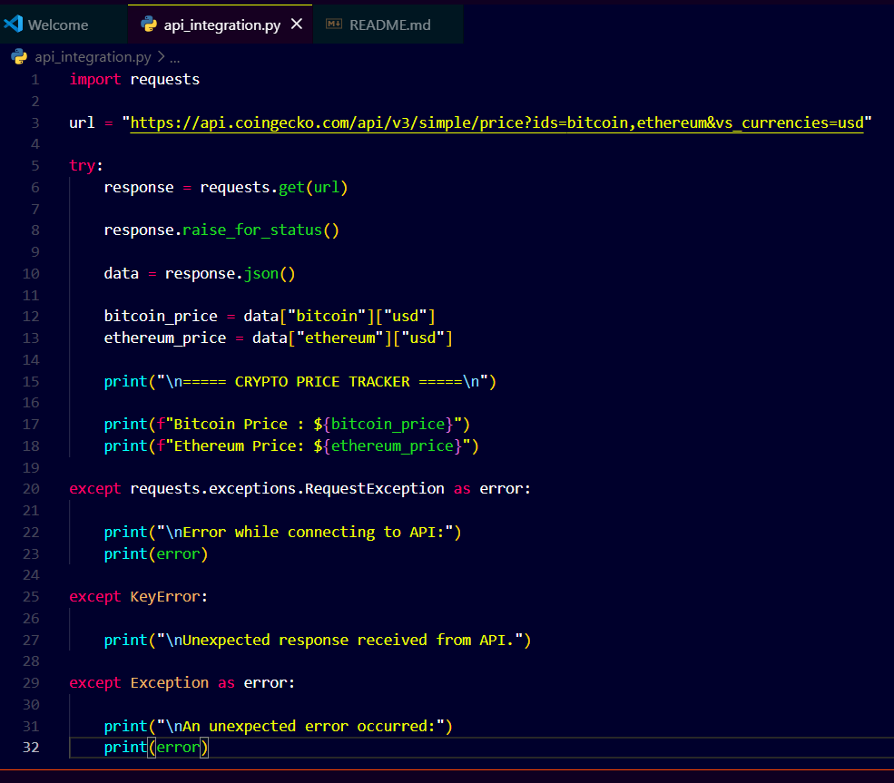
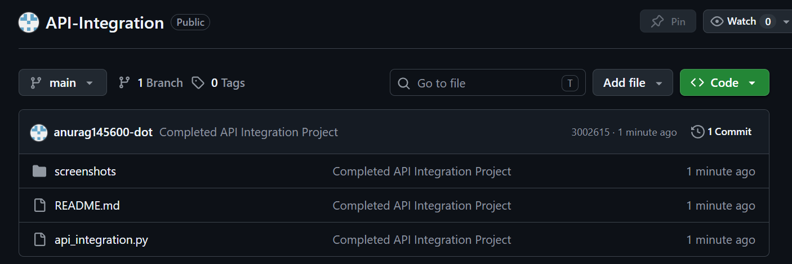

# API Integration

## Overview

API Integration is a Python-based application that fetches real-time cryptocurrency prices using the CoinGecko API and displays them in a user-friendly format.

The project demonstrates how to interact with external APIs, retrieve JSON data, parse responses, and handle errors effectively.

## Features

* Fetches real-time cryptocurrency prices
* Uses HTTP GET requests
* Parses JSON API responses
* Displays Bitcoin and Ethereum prices
* Handles API connection errors
* Clean and user-friendly output

## Technologies Used

* Python 3
* Requests Library
* CoinGecko API

## Project Structure

API_Integration/

├── api_integration.py

├── README.md

└── screenshots/

    ├── program_output.png

    ├── source_code.png

    └── github_repository.png

## How to Run the Project

### Step 1: Install Required Library

```bash
pip install requests
```

### Step 2: Run the Program

```bash
python api_integration.py
```

### Step 3: View Results

The program will display the latest cryptocurrency prices.

## Sample Output

```text
===== CRYPTO PRICE TRACKER =====

Bitcoin Price : $62537
Ethereum Price: $1645.96
```

## Screenshots

### Program Output



### Source Code



### GitHub Repository



## Concepts Used

* API Integration
* HTTP Requests
* JSON Parsing
* Exception Handling
* Data Retrieval
* Error Handling

## Learning Outcomes

Through this project, the following concepts were practiced:

* Working with external APIs
* Sending GET requests
* Processing JSON responses
* Handling API errors
* Displaying real-time data
* Building automation scripts

## Future Enhancements

* Support more cryptocurrencies
* Add currency conversion
* Display market trends
* Save data to CSV
* Build a GUI version

## Author

Anurag